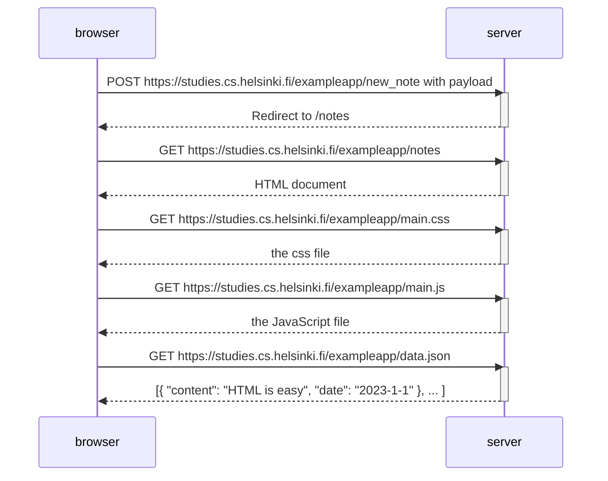
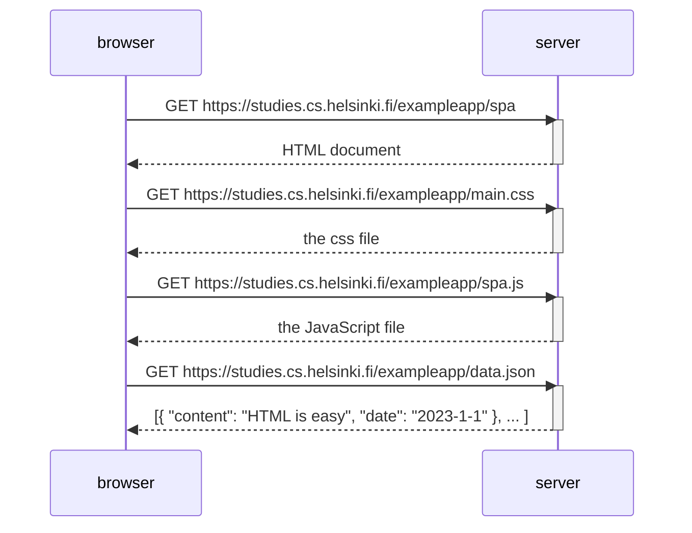
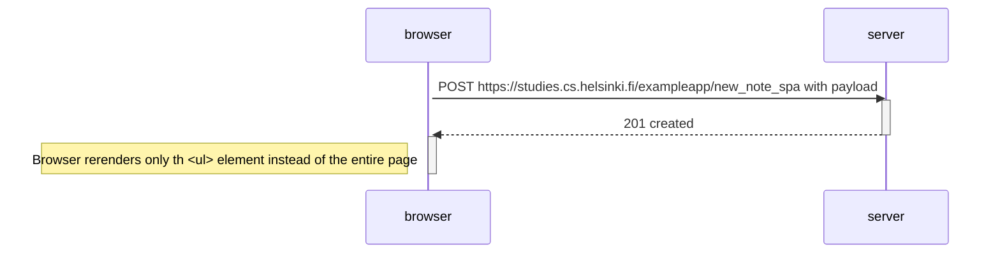

# Part 0

## ex0.4
Creating a new note will send a payload that will trigger the re-rendering of the entire page.

## ex0.5
Fetchin the SPA for the first time should be almost like fetching the traditional version.

## ex0.6

